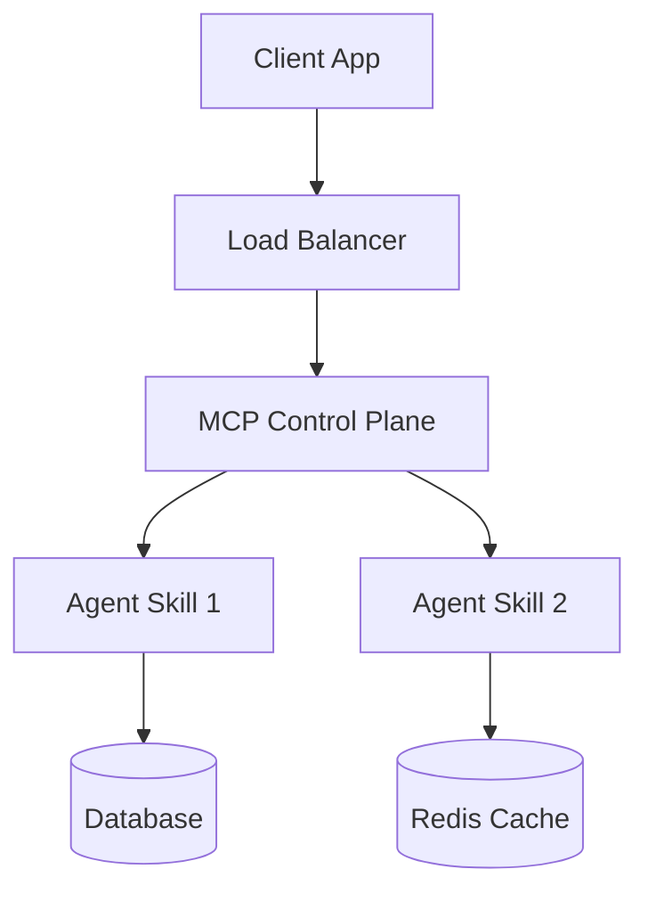

# Cloud Blueprint Creator Skill

## Overview

This skill provides comprehensive guidance for creating cloud-native deployment blueprints for MCP tools and AI agents using spec-driven governance. It covers MCP control plane patterns, Agent Skills orchestration, container orchestration, infrastructure as code, observability, security, and spec-driven development methodologies aligned with Spec-Kit Plus.

## When to Use This Skill

- Creating cloud-native deployment blueprints for MCP tools/agents
- Designing spec-driven deployment governance frameworks
- Implementing MCP control plane patterns for agent orchestration
- Building Agent Skills deployment architectures
- Developing Phase 3 cloud-native bonus features
- Architecting managed services for AI agent infrastructure
- Creating Kubernetes or Docker deployment manifests
- Designing CI/CD pipelines for agent deployment

## Before Implementation

Gather context to ensure successful implementation:

| Source | Gather |
|--------|--------|
| **Codebase** | Existing MCP tools, agent definitions, deployment configs, infrastructure |
| **Conversation** | User's deployment requirements, cloud provider, scale targets, security needs |
| **Skill References** | CNCF patterns, Spec-Kit Plus templates, Vectara MCP blog, MCP documentation |
| **User Guidelines** | Project governance policies, compliance requirements, deployment constraints |

Ensure all required context is gathered before implementing.

## Quick Start: Blueprint Structure

### 1. Blueprint Directory Structure

```bash
blueprints/
├── <blueprint-name>/
│   ├── blueprint.md              # Main blueprint specification
│   ├── manifests/                # Kubernetes/Infrastructure manifests
│   │   ├── deployment.yaml
│   │   ├── service.yaml
│   │   ├── configmap.yaml
│   │   └── ingress.yaml
│   ├── terraform/                # Terraform configurations (optional)
│   │   ├── main.tf
│   │   ├── variables.tf
│   │   └── outputs.tf
│   ├── ci-cd/                    # CI/CD pipeline configurations
│   │   ├── github-workflows.yaml
│   │   └── deployment-pipeline.yaml
│   ├── monitoring/               # Observability configurations
│   │   ├── prometheus-rules.yaml
│   │   ├── grafana-dashboards.json
│   │   └── alerting-rules.yaml
│   └── tests/                    # Blueprint validation tests
│       ├── unit-test.yaml
│       └── integration-test.yaml
```

### 2. Blueprint Metadata Template

```yaml
---
blueprint_name: <blueprint-name>
version: 1.0.0
created: <YYYY-MM-DD>
status: Draft
target_environment: <aws|gcp|azure|kubernetes|docker>
mcp_server: <server-name>
agent_skills: [<skill1>, <skill2>]
spec_compliance: spec-kit-plus
cncf_alignment: true
---
```

## Blueprint Specification Template

### Complete Blueprint Template

```markdown
# Cloud-Native Blueprint: [BLUEPRINT NAME]

**Version**: 1.0.0
**Target**: [Kubernetes/AWS/GCP/Azure]
**MCP Server**: [server-name]
**Agent Skills**: [skill1, skill2]
**Created**: [DATE]
**Status**: Draft

## Executive Summary

[Provide 2-3 sentence overview of the blueprint purpose and key architectural decisions]

### Scope
**In Scope**:
- [Component 1]
- [Component 2]
- [Deployment automation]

**Out of Scope**:
- [Excluded component 1]
- [Excluded component 2]

### Key Decisions
| Decision | Rationale | Alternatives Considered |
|----------|-----------|------------------------|
| [Decision 1] | [Why] | [Alt A, Alt B] |
| [Decision 2] | [Why] | [Alt A, Alt B] |

## Architecture Specifications

### Component Diagram


### Service Interactions
| Service | Protocol | Port | Description |
|---------|----------|------|-------------|
| [Service 1] | HTTP/REST | 8080 | [Description] |
| [Service 2] | gRPC | 9090 | [Description] |
| MCP Server | stdio/SSE | - | Tool execution |

### MCP Control Plane Integration
**Pattern**: Coordinator-Specialist with MCP as orchestration layer

**Control Plane Components**:
- Tool Registry: Dynamic tool discovery and registration
- Execution Engine: Async tool execution with timeout handling
- State Manager: Distributed state for long-running operations
- Circuit Breaker: Fault tolerance for failing tools

## Deployment Manifests

### Kubernetes Deployment

```yaml
# manifests/deployment.yaml
apiVersion: apps/v1
kind: Deployment
metadata:
  name: mcp-server
  labels:
    app: mcp-server
    version: v1
spec:
  replicas: 3
  selector:
    matchLabels:
      app: mcp-server
  template:
    metadata:
      labels:
        app: mcp-server
        version: v1
    spec:
      containers:
      - name: mcp-server
        image: your-registry/mcp-server:latest
        ports:
        - containerPort: 8080
          name: http
        env:
        - name: JWT_SECRET
          valueFrom:
            secretKeyRef:
              name: mcp-secrets
              key: jwt-secret
        - name: DATABASE_URL
          valueFrom:
            secretKeyRef:
              name: mcp-secrets
              key: database-url
        resources:
          requests:
            memory: "256Mi"
            cpu: "250m"
          limits:
            memory: "512Mi"
            cpu: "500m"
        livenessProbe:
          httpGet:
            path: /health
            port: 8080
          initialDelaySeconds: 30
          periodSeconds: 10
        readinessProbe:
          httpGet:
            path: /ready
            port: 8080
          initialDelaySeconds: 10
          periodSeconds: 5
```

### Kubernetes Service

```yaml
# manifests/service.yaml
apiVersion: v1
kind: Service
metadata:
  name: mcp-server-service
spec:
  type: ClusterIP
  selector:
    app: mcp-server
  ports:
  - port: 80
    targetPort: 8080
    protocol: TCP
    name: http
```

### ConfigMap for MCP Configuration

```yaml
# manifests/configmap.yaml
apiVersion: v1
kind: ConfigMap
metadata:
  name: mcp-config
data:
  mcp-config.yaml: |
    server:
      name: hackathon-todo-server
      max_concurrent_requests: 100
      timeout_seconds: 30

    tools:
      - name: add_task
        enabled: true
        rate_limit: 10/minute
      - name: list_tasks
        enabled: true
        rate_limit: 50/minute

    security:
      jwt_required: true
      user_isolation: true
```

## Observability & Operations

### Logging Strategy
**Standard**: Structured JSON logs
**Aggregation**: [Fluentd/Loki/Cloud Logging]

```python
# Python logging configuration
import structlog

logger = structlog.get_logger()
logger.info(
    "tool_execution",
    tool_name="add_task",
    user_id="user_123",
    execution_time_ms=45,
    status="success"
)
```

### Metrics Collection
**Framework**: Prometheus
**Key Metrics**:
- `mcp_tool_execution_total{tool_name, status}` - Counter
- `mcp_tool_duration_seconds{tool_name}` - Histogram
- `mcp_active_connections` - Gauge
- `mcp_request_errors_total{error_type}` - Counter

```yaml
# monitoring/prometheus-rules.yaml
apiVersion: monitoring.coreos.com/v1
kind: PrometheusRule
metadata:
  name: mcp-alerts
spec:
  groups:
  - name: mcp.rules
    rules:
    - alert: MCPHighErrorRate
      expr: rate(mcp_request_errors_total[5m]) > 0.05
      for: 5m
      labels:
        severity: warning
      annotations:
        summary: "High MCP error rate detected"
        description: "Error rate is {{ $value }} errors/sec"
```

### Health Checks

```python
# FastAPI health endpoints
from fastapi import FastAPI
from app.db.session import engine

app = FastAPI()

@app.get("/health")
async def health_check():
    """Liveness probe - is the app running?"""
    return {"status": "healthy"}

@app.get("/ready")
async def readiness_check():
    """Readiness probe - can the app handle traffic?"""
    try:
        async with engine.begin() as conn:
            await conn.execute("SELECT 1")
        return {"status": "ready", "database": "connected"}
    except Exception as e:
        return {"status": "not_ready", "database": str(e)}
```

## Security & Compliance

### Authentication Pattern
**Method**: JWT Bearer Token
**Middleware**: FastAPI Dependency

```python
from fastapi import Depends, HTTPException, status
from fastapi.security import HTTPBearer, HTTPAuthorizationCredentials
from jose import jwt, JWTError

security = HTTPBearer()

async def verify_jwt(
    credentials: HTTPAuthorizationCredentials = Depends(security)
) -> dict:
    """Verify JWT token and extract user_id"""
    try:
        token = credentials.credentials
        payload = jwt.decode(token, JWT_SECRET, algorithms=["HS256"])
        user_id = payload.get("sub")
        if not user_id:
            raise HTTPException(status_code=401, detail="Invalid token")
        return {"user_id": user_id}
    except JWTError:
        raise HTTPException(status_code=401, detail="Invalid token")
```

### Network Policies

```yaml
# manifests/network-policy.yaml
apiVersion: networking.k8s.io/v1
kind: NetworkPolicy
metadata:
  name: mcp-server-policy
spec:
  podSelector:
    matchLabels:
      app: mcp-server
  policyTypes:
  - Ingress
  - Egress
  ingress:
  - from:
    - namespaceSelector:
        matchLabels:
          name: ingress-nginx
    ports:
    - protocol: TCP
      port: 8080
  egress:
  - to:
    - podSelector:
        matchLabels:
          app: postgresql
    ports:
    - protocol: TCP
      port: 5432
```

### Secret Management
**Strategy**: Kubernetes Secrets + External Secret Operator (recommended)
**Never hardcode secrets** - use `.env` for local, sealed-secrets/vault for production

## CI/CD Integration

### GitHub Actions Workflow

```yaml
# .github/workflows/deploy-mcp-blueprint.yaml
name: Deploy MCP Blueprint

on:
  push:
    paths:
    - 'blueprints/<blueprint-name>/**'
    - 'backend/app/mcp/**'

jobs:
  validate-blueprint:
    runs-on: ubuntu-latest
    steps:
    - uses: actions/checkout@v3
    - name: Validate Blueprint Specs
      run: |
        # Validate blueprint structure
        python -m blueprints.validate \
          --blueprint blueprints/<blueprint-name>/blueprint.md

    - name: Lint Kubernetes Manifests
      run: |
        kubectl apply --dry-run=client \
          -f blueprints/<blueprint-name>/manifests/

  build-and-push:
    needs: validate-blueprint
    runs-on: ubuntu-latest
    steps:
    - uses: actions/checkout@v3
    - name: Build Docker Image
      run: |
        docker build -t mcp-server:${{ github.sha }} .
        docker tag mcp-server:${{ github.sha }} mcp-server:latest

    - name: Push to Registry
      run: |
        echo ${{ secrets.REGISTRY_PASSWORD }} | docker login -u ${{ secrets.REGISTRY_USER }} --password-stdin
        docker push mcp-server:${{ github.sha }}

  deploy-to-cluster:
    needs: build-and-push
    runs-on: ubuntu-latest
    environment: production
    steps:
    - name: Deploy to Kubernetes
      run: |
        kubectl set image deployment/mcp-server \
          mcp-server=mcp-server:${{ github.sha }}
        kubectl apply -f blueprints/<blueprint-name>/manifests/

    - name: Verify Deployment
      run: |
        kubectl rollout status deployment/mcp-server
        kubectl get pods -l app=mcp-server
```

## Migration & Rollback

### Deployment Strategy
**Pattern**: Blue-Green Deployment
**Cutover**: Service selector update (instant rollback)

```yaml
# manifests/blue-green-service.yaml
apiVersion: v1
kind: Service
metadata:
  name: mcp-server-service
spec:
  selector:
    app: mcp-server
    version: blue  # Switch to 'green' for cutover
  ports:
  - port: 80
    targetPort: 8080
```

### Rollback Procedure
```bash
# Instant rollback via selector update
kubectl patch service mcp-server-service -p '{"spec":{"selector":{"version":"blue"}}}'

# Or rollback to previous deployment
kubectl rollout undo deployment/mcp-server
```

## Feature Flags

```python
# Feature flag integration
from featureflags import get_flag

async def execute_tool(tool_name: str, params: dict):
    if get_flag(f"tool.{tool_name}.enabled", default=False):
        return await tool.execute(params)
    else:
        return {"error": "Tool disabled via feature flag"}
```

## Blueprint Validation Checklist

Before marking blueprint as ready for `/sp.implement`:

- [ ] **Structure**: All blueprint sections completed (executive summary → rollback)
- [ ] **Spec-Driven**: Blueprint aligns with Spec-Kit Plus template patterns
- [ ] **MCP Integration**: MCP control plane patterns clearly defined
- [ ] **Agent Skills**: Agent orchestration and skill delegation documented
- [ ] **Security**: JWT/mTLS, secrets management, network policies specified
- [ ] **Observability**: Logs, metrics, traces, alerting configured
- [ ] **Rollback**: Blue-green/canary strategy with rollback procedure
- [ ] **CI/CD**: Pipeline automated from commit to deployment
- [ ] **Testing**: Unit, integration, E2E test definitions included
- [ ] **CNCF Alignment**: Follows CNCF agentic systems patterns
- [ ] **Acceptance Criteria**: All scenarios testable and measurable
- [ ] **Resource Budgets**: CPU/memory limits defined
- [ ] **SLOs**: Performance targets documented (p95 latency, uptime)
- [ ] **Compliance**: Audit logging, data handling specified
- [ ] **Documentation**: Runbooks for operations included

## Spec-Driven Governance Integration

### Blueprint as Spec
Blueprints should integrate with `/sp.implement` workflow:

1. **Create Blueprint Spec** → `specs/<blueprint-name>/blueprint-spec.md`
2. **Generate Tasks** → Run `/sp.tasks` to create implementation tasks
3. **Execute Implementation** → Run `/sp.implement` to deploy
4. **Validate Deployment** → Automated tests verify blueprint compliance

### Blueprint Spec Template

```markdown
# Blueprint Spec: [BLUEPRINT NAME]

## User Scenarios & Testing

### User Story 1 - Deploy MCP Server (Priority: P1)

Deploy the MCP server with all Todo tools to Kubernetes cluster.

**Independent Test**: Can deploy MCP server with `kubectl apply -f manifests/` and verify via `/health` endpoint

**Acceptance Scenarios**:
1. Given a valid Kubernetes cluster, When deployment manifests are applied, Then MCP server pods are running and ready
2. Given MCP server is running, When `/health` endpoint is called, Then status returns "healthy"
3. Given MCP server is deployed, When JWT token is missing, Then request returns 401 Unauthorized

## Requirements

### Functional Requirements
- **FR-001**: System MUST deploy MCP server with 3 replicas for high availability
- **FR-002**: System MUST enforce JWT authentication on all MCP tool endpoints
- **FR-003**: System MUST isolate tool execution by user_id
- **FR-004**: System MUST expose Prometheus metrics on `/metrics` endpoint
- **FR-005**: System MUST implement health checks on `/health` and `/ready`

## Success Criteria

### Measurable Outcomes
- **SC-001**: Deployment completes in under 5 minutes
- **SC-002**: MCP server achieves p95 latency < 100ms for tool execution
- **SC-003**: System maintains 99.9% uptime during normal operations
- **SC-004**: Rollback completes in under 30 seconds
```

## Production Deployment Patterns

### MCP Tool Server Blueprint

**Use Case**: Deploy MCP tool server for Todo operations

```yaml
---
blueprint_name: mcp-todo-server
version: 1.0.0
target_environment: kubernetes
mcp_server: hackathon-todo-server
agent_skills: [todo_crud, user_isolation]
spec_compliance: spec-kit-plus
---

# MCP Todo Server Blueprint

## Executive Summary
Deploys MCP server with 5 Todo tools (add, list, update, complete, delete) with JWT authentication and user isolation.

## Architecture
- **Ingress**: NGINX Ingress Controller → TLS termination
- **Service**: ClusterIP service for internal cluster traffic
- **Deployment**: 3 replicas, rolling update strategy
- **Database**: Neon PostgreSQL (external managed service)
- **Cache**: Redis for session storage (optional)
```

### Multi-Agent Orchestration Blueprint

**Use Case**: Deploy orchestration engine for multiple agent skills

```yaml
---
blueprint_name: multi-agent-orchestration
version: 1.0.0
target_environment: kubernetes
mcp_server: orchestration-server
agent_skills: [nlp_parser, todo_crud, voice_input, urdu_translator]
spec_compliance: spec-kit-plus
---

# Multi-Agent Orchestration Blueprint

## Executive Summary
Deploys orchestration engine with coordinator-specialist pattern, message bus for inter-agent communication, circuit breaker for fault tolerance.

## Architecture
- **Orchestration Engine**: FastAPI server with agent registry
- **Message Bus**: Redis Pub/Sub for agent communication
- **State Manager**: PostgreSQL for distributed state
- **Metrics**: Prometheus + Grafana for monitoring
```

## Testing Strategy

### Blueprint Validation Tests

```python
# tests/test_blueprint_validation.py
import pytest
from pathlib import Path

def test_blueprint_structure():
    """Validate blueprint has all required sections"""
    blueprint_path = Path("blueprints/<name>/blueprint.md")
    content = blueprint_path.read_text()

    required_sections = [
        "## Executive Summary",
        "## Architecture Specifications",
        "## Deployment Manifests",
        "## Observability & Operations",
        "## Security & Compliance",
        "## Migration & Rollback"
    ]

    for section in required_sections:
        assert section in content, f"Missing section: {section}"

def test_kubernetes_manifests_valid():
    """Validate Kubernetes manifests with kubectl dry-run"""
    import subprocess

    result = subprocess.run(
        ["kubectl", "apply", "--dry-run=client", "-f", "blueprints/<name>/manifests/"],
        capture_output=True,
        text=True
    )
    assert result.returncode == 0, f"Invalid manifests: {result.stderr}"

def test_ci_cd_pipeline_configured():
    """Validate CI/CD workflow exists and is valid YAML"""
    import yaml

    workflow_path = Path(".github/workflows/deploy-mcp-blueprint.yaml")
    with open(workflow_path) as f:
        config = yaml.safe_load(f)

    assert "jobs" in config
    assert "validate-blueprint" in config["jobs"]
    assert "deploy-to-cluster" in config["jobs"]
```

## Cloud Provider Specifics

### AWS EKS Deployment

```hcl
# terraform/main.tf
resource "aws_eks_cluster" "mcp_cluster" {
  name     = "mcp-server-cluster"
  role_arn = aws_iam_role.eks_role.arn
  version  = "1.28"

  vpc_config {
    subnet_ids = aws_subnet.private[*].id
  }
}

resource "aws_ecs_task_definition" "mcp_server" {
  family                   = "mcp-server"
  network_mode             = "awsvpc"
  requires_compatibilities = ["FARGATE"]
  cpu                      = "512"
  memory                   = "1024"

  container_definitions = jsonencode([
    {
      name      = "mcp-server"
      image     = "${var.ecr_repository_url}:latest"
      essential = true
      portMappings = [{ containerPort = 8080 }]
      environment = [
        { name = "JWT_SECRET", value = "" }
      ]
      secrets = [
        { name = "DATABASE_URL", valueFrom = aws_secretsmanager_secret.db_url.arn }
      ]
    }
  ])
}
```

### Google Cloud GKE Deployment

```yaml
# manifests/gke-deployment.yaml
apiVersion: cloud.google.com/v1
kind: BackendConfig
metadata:
  name: mcp-server-backendconfig
spec:
  healthCheck:
    checkIntervalSec: 10
    timeoutSec: 5
    healthyThreshold: 2
    unhealthyThreshold: 3
    type: HTTP
    requestPath: /health
    port: 8080
---
apiVersion: networking.gke.io/v1
kind: ManagedCertificate
metadata:
  name: mcp-server-cert
spec:
  domains:
  - mcp-server.example.com
```

### Azure AKS Deployment

```bicep
// deploy/aks-main.bicep
resource aksCluster 'Microsoft.ContainerService/managedClusters@2023-01-01' = {
  name: 'mcp-server-cluster'
  location: resourceGroup().location
  properties: {
    dnsPrefix: 'mcp-server'
    agentPoolProfiles: [
      {
        name: 'system'
        count: 3
        vmSize: 'Standard_DS2_v2'
        osType: 'Linux'
      }
    ]
  }
}

resource mcpServerDeployment 'Microsoft.Resources/deployments@2021-04-01' = {
  name: 'mcp-server-deployment'
  properties: {
    mode: 'Incremental'
    template: loadJsonContent('manifests/deployment.yaml')
  }
}
```

## 16-Point Quality Assurance Checklist

Before finalizing any blueprint:

- [ ] **Blueprint Structure**: All required sections present and complete
- [ ] **Spec-Driven**: Aligns with Spec-Kit Plus template patterns
- [ ] **MCP Patterns**: Control plane, tool registry, execution engine defined
- [ ] **Agent Orchestration**: Coordinator-specialist or other pattern documented
- [ ] **Security**: JWT/mTLS, secrets, network policies specified
- [ ] **Observability**: Structured logs, Prometheus metrics, tracing configured
- [ ] **Health Checks**: Liveness and readiness probes defined
- [ ] **Resource Limits**: CPU/memory requests and limits set
- [ ] **High Availability**: Replica count >= 3, anti-affinity rules
- [ ] **CI/CD**: Automated pipeline from commit to deployment
- [ ] **Rollback**: Blue-green or canary with documented rollback
- [ ] **Testing**: Unit, integration, E2E tests specified
- [ ] **Documentation**: Runbooks for operations included
- [ ] **SLOs**: Performance targets (p95 latency, uptime) defined
- [ ] **Compliance**: Audit logging, data handling documented
- [ ] **ADRs**: Significant architectural decisions recorded

## References and Further Reading

- [CNCF Agentic Systems Issues](https://github.com/cncf/tag-convergence/issues?q=is%3Aissue+is%3Aopen+agentic)
- [Vectara: MCP for Agentic AI](https://vectara.com/blog/mcp-model-context-protocol-for-agentic-ai/)
- [MCP Official Documentation](https://modelcontextprotocol.io/docs)
- [Kubernetes Deployment Patterns](https://kubernetes.io/docs/concepts/workloads/controllers/deployment/)
- [Prometheus Best Practices](https://prometheus.io/docs/practices/)
- [GitOps with ArgoCD](https://argoproj.github.io/argo-cd/)
- [Feature Flag Patterns](https://martinfowler.com/articles/feature-toggles.html)

---

## Summary

This skill enables creation of production-grade cloud-native blueprints for MCP tools and AI agents with:

✅ **Spec-Driven Governance**: Aligned with Spec-Kit Plus methodology
✅ **MCP Control Plane**: Tool registry, execution engine, state management
✅ **Agent Orchestration**: Coordinator-specialist, message bus patterns
✅ **Cloud-Native**: Kubernetes, Docker, Terraform, CI/CD
✅ **Production-Ready**: Security, observability, rollback, testing
✅ **CNCF Aligned**: Follows cloud-native best practices

Every blueprint created with this skill bridges the gap from "spec" to "production" for agentic AI systems.
