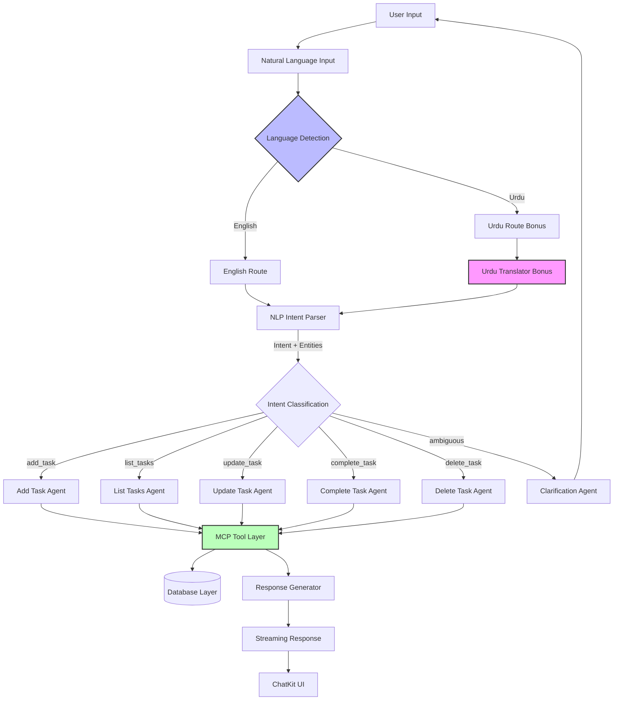

# specs/agent-logic.md

## Agent Orchestration & NLP Logic Specification

**Status:** Draft | **Priority:** Critical | **Dependencies:** @constitution.md Section 3.2-3.4, @specs/features/task-crud-backend.md, @specs/api/rest-endpoints.md

---

## Overview

Define the agent orchestration layer for Phase 3 AI-Powered Todo Chatbot. This specification covers natural language processing, intent parsing, MCP tool calling, error handling, streaming responses, and bonus features (Urdu language support, voice commands) using OpenAI Agents SDK patterns with Cohere as the LLM provider.

**Core Goals:**
1. Parse natural language commands into structured Todo operations
2. Delegate to MCP tools for all CRUD operations (5 Basic Level features)
3. Handle edge cases gracefully with user-friendly error messages
4. Stream responses to ChatKit UI for real-time feedback
5. Support bonus features: Urdu language, voice input

**Technology Stack:**
- **LLM Provider:** Cohere API (COHERE_API_KEY)
- **Agent Framework:** OpenAI Agents SDK patterns (adapted for Cohere)
- **Tool Protocol:** Model Context Protocol (MCP) - Official MCP SDK
- **NLP:** Intent parsing + entity extraction via Cohere
- **Chat UI:** OpenAI ChatKit integration
- **Voice:** Web Speech API (bonus)

---

## 1. Agent Workflow Architecture

### 1.1 High-Level Architecture Diagram



### 1.2 Component Responsibilities

**Frontend (Next.js):**
- `ChatWidget.tsx` - ChatKit UI component
- `VoiceInput.tsx` - Web Speech API integration (bonus)
- `useAgents.ts` - Custom hook for agent communication
- `/api/chat` - API route that forwards to backend

**Backend (FastAPI):**
- `/api/agent/chat` - Main agent chat endpoint
- `TodoAgentOrchestrator` - Coordinates agent workflows
- `NLPIntentParser` - Parses natural language into intents/entities
- `TodoCRUDAgent` - Routes to appropriate MCP tools
- `UrduTranslator` - Translates Urdu to English (bonus)
- `ResponseGenerator` - Formats tool results into natural language
- MCP tools - 5 Todo CRUD tools (add, list, update, complete, delete)

---

## 2. NLP Intent Parsing Patterns

### 2.1 Intent Categories

The system must recognize 5 core intents corresponding to the 5 Basic Level features:

| Intent | Description | Example Commands |
|--------|-------------|------------------|
| `add_task` | Create a new task | "Add grocery shopping", "Create a task to review PR", "New todo: call mom" |
| `list_tasks` | Display user's tasks | "Show my tasks", "What's pending?", "List all todos", "Show high priority tasks" |
| `update_task` | Modify existing task | "Reschedule meeting to 2 PM", "Change priority to high", "Update task title" |
| `complete_task` | Mark task as done | "Mark morning meeting as complete", "Finish task 123", "Done with the grocery task" |
| `delete_task` | Remove a task | "Delete old task", "Remove the grocery task", "Clear task about buying milk" |

### 2.2 Entity Extraction

**Entities to Extract:**

1. **Task Title** (string)
   - Examples: "grocery shopping", "review the PR", "call mom"
   - Source: Direct object of add/create commands

2. **Task Description** (string, optional)
   - Examples: "by Friday", "for the project", "with high priority"
   - Source: Prepositional phrases, modifiers

3. **Priority** (enum: low/medium/high)
   - Keywords: "urgent", "important", "ASAP" → high
   - Keywords: "low priority", "whenever" → low
   - Default: medium

4. **Task ID** (string/integer, optional)
   - Examples: "task 123", "the meeting task", "that task"
   - Source: Numeric references, anaphoric references
   - Fallback: Ask for clarification if ambiguous

5. **Temporal Expressions** (datetime, optional)
   - Examples: "tomorrow at 3pm", "by Friday", "next week"
   - Parsing: Use dateparser or Cohere's built-in entity recognition

6. **Status Filter** (enum: pending/completed/all)
   - Keywords: "pending", "incomplete", "not done" → pending
   - Keywords: "completed", "done", "finished" → completed
   - Default: all

### 2.3 Intent Parsing Examples

**Example 1: Add Task**
```
Input: "Add a task to review the PR by Friday with high priority"

Intent Parser Output:
{
  "intent": "add_task",
  "entities": {
    "title": "review the PR",
    "description": "by Friday",
    "priority": "high"
  },
  "confidence": 0.95
}
```

**Example 2: List Tasks with Filter**
```
Input: "Show me all my pending high priority tasks"

Intent Parser Output:
{
  "intent": "list_tasks",
  "entities": {
    "status": "pending",
    "priority": "high"
  },
  "confidence": 0.92
}
```

**Example 3: Update Task (Reschedule)**
```
Input: "Reschedule the meeting to tomorrow at 3pm"

Intent Parser Output:
{
  "intent": "update_task",
  "entities": {
    "task_identifier": "the meeting",
    "new_due_date": "tomorrow at 3pm"
  },
  "confidence": 0.88,
  "ambiguity": "task_identifier"  // May need clarification
}
```

**Example 4: Complete Task**
```
Input: "Mark the morning meeting as done"

Intent Parser Output:
{
  "intent": "complete_task",
  "entities": {
    "task_identifier": "morning meeting"
  },
  "confidence": 0.91
}
```

**Example 5: Delete Task**
```
Input: "Delete the old grocery task"

Intent Parser Output:
{
  "intent": "delete_task",
  "entities": {
    "task_identifier": "grocery task"
  },
  "confidence": 0.89,
  "ambiguity": "task_identifier"  // "old" is vague
}
```

---

## 3. MCP Tool Calling Orchestration

### 3.1 MCP Tool Definitions

All MCP tools must use the Official MCP SDK (`mcp.server.fastmcp`). Tools enforce user isolation via JWT context.

**File:** `backend/app/mcp/tools/todo_tools.py`

```python
from mcp.server.fastmcp import FastMCP
from typing import Optional, List
from datetime import datetime

mcp = FastMCP(name="hackathon-todo-server")

# ============================================================================
# MCP Tool 1: add_task
# ============================================================================
@mcp.tool()
async def add_task(
    title: str,
    description: Optional[str] = None,
    priority: str = "medium"
) -> dict:
    """
    Add a new task for the authenticated user.

    Args:
        title: Task title (required, 1-200 chars)
        description: Task description (optional, max 1000 chars)
        priority: Task priority (low/medium/high, default: medium)

    Returns:
        Created task object with id, title, priority, completed, timestamps

    Raises:
        ValueError: If title is invalid or priority is not valid enum
    """
    # Implementation: Get user_id from JWT context (set by middleware)
    # Create task in database with user_id
    # Return task object
    pass

# ============================================================================
# MCP Tool 2: list_tasks
# ============================================================================
@mcp.tool()
async def list_tasks(
    status: Optional[str] = None,
    priority: Optional[str] = None,
    sort_by: str = "created_at",
    order: str = "desc",
    limit: int = 100,
    offset: int = 0
) -> dict:
    """
    List all tasks for the authenticated user.

    Args:
        status: Filter by status (pending/completed/all, default: all)
        priority: Filter by priority (low/medium/high, default: all)
        sort_by: Sort field (created_at/title/priority/updated_at)
        order: Sort direction (asc/desc)
        limit: Max results (1-1000)
        offset: Pagination offset

    Returns:
        Dictionary with tasks array, total count, limit, offset
    """
    # Implementation: Query database with user_id filter
    # Apply filters, sorting, pagination
    # Return paginated task list
    pass

# ============================================================================
# MCP Tool 3: update_task
# ============================================================================
@mcp.tool()
async def update_task(
    task_id: str,
    title: Optional[str] = None,
    description: Optional[str] = None,
    priority: Optional[str] = None,
    due_date: Optional[datetime] = None
) -> dict:
    """
    Update a task (user must own the task).

    Args:
        task_id: Task ID to update (required)
        title: New title (optional)
        description: New description (optional)
        priority: New priority (optional)
        due_date: New due date (optional)

    Returns:
        Updated task object

    Raises:
        PermissionError: If task doesn't belong to user
        NotFoundError: If task doesn't exist
    """
    # Implementation: Verify task ownership via user_id
    # Update only provided fields
    # Update updated_at timestamp
    # Return updated task
    pass

# ============================================================================
# MCP Tool 4: complete_task
# ============================================================================
@mcp.tool()
async def complete_task(task_id: str) -> dict:
    """
    Mark a task as complete.

    Args:
        task_id: Task ID to mark complete (required)

    Returns:
        Updated task object with completed=True

    Raises:
        PermissionError: If task doesn't belong to user
        NotFoundError: If task doesn't exist
    """
    # Implementation: Verify task ownership
    # Set completed=True
    # Update updated_at timestamp
    # Return updated task
    pass

# ============================================================================
# MCP Tool 5: delete_task
# ============================================================================
@mcp.tool()
async def delete_task(task_id: str) -> dict:
    """
    Delete a task permanently.

    Args:
        task_id: Task ID to delete (required)

    Returns:
        Confirmation message with deleted task ID

    Raises:
        PermissionError: If task doesn't belong to user
        NotFoundError: If task doesn't exist
    """
    # Implementation: Verify task ownership
    # Delete from database
    # Return confirmation
    pass
```

### 3.2 Agent-to-Tool Parameter Mapping

**Add Task Workflow:**
```python
# Intent parser output:
{
  "intent": "add_task",
  "entities": {
    "title": "review the PR",
    "description": "by Friday",
    "priority": "high"
  }
}

# Mapped to MCP tool call:
await mcp.call_tool(
    "add_task",
    title="review the PR",
    description="Due by Friday",
    priority="high"
)
```

**List Tasks Workflow:**
```python
# Intent parser output:
{
  "intent": "list_tasks",
  "entities": {
    "status": "pending",
    "priority": "high"
  }
}

# Mapped to MCP tool call:
await mcp.call_tool(
    "list_tasks",
    status="pending",
    priority="high",
    sort_by="created_at",
    order="desc",
    limit=100
)
```

**Update Task Workflow:**
```python
# Intent parser output:
{
  "intent": "update_task",
  "entities": {
    "task_identifier": "the meeting",
    "new_due_date": "tomorrow at 3pm"
  }
}

# Step 1: Resolve task_identifier to task_id
tasks = await mcp.call_tool("list_tasks")
task_id = resolve_task_identifier(tasks, "the meeting")

# Step 2: Parse temporal expression
due_date = parse_datetime("tomorrow at 3pm")

# Step 3: Call update tool
await mcp.call_tool(
    "update_task",
    task_id=task_id,
    due_date=due_date
)
```

**Complete Task Workflow:**
```python
# Intent parser output:
{
  "intent": "complete_task",
  "entities": {
    "task_identifier": "morning meeting"
  }
}

# Step 1: Resolve task_identifier
tasks = await mcp.call_tool("list_tasks", status="pending")
task_id = resolve_task_identifier(tasks, "morning meeting")

# Step 2: Call complete tool
await mcp.call_tool("complete_task", task_id=task_id)
```

**Delete Task Workflow:**
```python
# Intent parser output:
{
  "intent": "delete_task",
  "entities": {
    "task_identifier": "grocery task"
  }
}

# Step 1: Resolve task_identifier
tasks = await mcp.call_tool("list_tasks")
task_id = resolve_task_identifier(tasks, "grocery task")

# Step 2: Call delete tool
await mcp.call_tool("delete_task", task_id=task_id)
```

### 3.3 Tool Calling with Cohere

**File:** `backend/app/agents/tool_caller.py`

```python
import cohere
from typing import Dict, Any, List
import os

COHERE_API_KEY = os.getenv("COHERE_API_KEY")

class CohereToolCaller:
    """
    Wrapper for Cohere API with tool calling capabilities.
    """

    def __init__(self):
        self.client = cohere.Client(COHERE_API_KEY)

    async def call_tool(
        self,
        tool_name: str,
        **parameters
    ) -> Dict[str, Any]:
        """
        Call an MCP tool with error handling and retries.

        Args:
            tool_name: Name of the MCP tool to call
            **parameters: Tool parameters

        Returns:
            Tool result dictionary

        Raises:
            ToolError: If tool call fails after retries
        """
        max_retries = 3
        base_delay = 1.0  # seconds

        for attempt in range(max_retries):
            try:
                # Import MCP tools
                from app.mcp.tools.todo_tools import mcp

                # Call the tool
                result = await mcp.call_tool(tool_name, **parameters)

                return result

            except Exception as e:
                if attempt < max_retries - 1:
                    # Exponential backoff
                    delay = base_delay * (2 ** attempt)
                    await asyncio.sleep(delay)
                else:
                    raise ToolError(
                        f"Tool '{tool_name}' failed after {max_retries} attempts: {str(e)}"
                    )

    async def call_tools_parallel(
        self,
        tool_calls: List[Dict[str, Any]]
    ) -> List[Dict[str, Any]]:
        """
        Call multiple tools in parallel.

        Args:
            tool_calls: List of {"tool_name": str, "parameters": dict}

        Returns:
            List of tool results
        """
        tasks = [
            self.call_tool(call["tool_name"], **call.get("parameters", {}))
            for call in tool_calls
        ]
        return await asyncio.gather(*tasks)


class ToolError(Exception):
    """Raised when tool call fails."""
    pass
```

---

## 4. Error Handling & Ambiguity Resolution

### 4.1 Error Taxonomy

| Error Type | Severity | Recovery Strategy |
|------------|----------|-------------------|
| **Ambiguous Intent** | Low | Ask clarifying question (2-3 options) |
| **Missing Required Parameter** | Medium | Prompt for specific missing value |
| **Task Not Found** | Medium | Suggest similar tasks or ask to specify |
| **Invalid Date/Time** | Medium | Offer alternative formats or ask to rephrase |
| **Tool Execution Failure** | High | Retry with exponential backoff, then escalate |
| **JWT Token Invalid** | Critical | Return 401, prompt re-authentication |
| **User ID Mismatch** | Critical | Return 403 (security violation) |

### 4.2 Ambiguity Resolution Patterns

**Pattern 1: Ambiguous Task Identifier**
```python
# Input: "Complete the meeting task"
# Problem: User has multiple meeting tasks

async def resolve_task_identifier(user_id: str, identifier: str) -> str:
    """
    Resolve fuzzy task identifier to specific task_id.

    Strategy:
    1. Search for tasks with matching title/description
    2. If multiple matches, present options to user
    3. If no matches, ask for clarification
    """
    tasks = await list_tasks(user_id=user_id)

    # Fuzzy search
    matches = [
        task for task in tasks["tasks"]
        if identifier.lower() in task["title"].lower()
    ]

    if len(matches) == 0:
        raise AmbiguityError(
            f"No tasks found matching '{identifier}'. "
            f"Please specify the task title or ID."
        )

    elif len(matches) == 1:
        return matches[0]["id"]

    else:  # Multiple matches
        options = "\n".join([
            f"- {task['id']}: {task['title']}"
            for task in matches[:3]  # Limit to 3 options
        ])
        raise AmbiguityError(
            f"Multiple tasks match '{identifier}':\n{options}\n"
            f"Please specify which one by ID or more details."
        )
```

**Pattern 2: Missing Required Parameter**
```python
# Input: "Add a task" (missing title)

async def validate_add_task_params(entities: dict) -> dict:
    """
    Validate add_task parameters, prompt for missing values.
    """
    if "title" not in entities or not entities["title"]:
        raise MissingParameterError(
            "What task would you like to add? Please provide a title."
        )

    # Validate title length
    title = entities["title"]
    if len(title) > 200:
        raise ValidationError(
            f"Title is too long ({len(title)} chars). Please use 200 characters or less."
        )

    return entities
```

**Pattern 3: Invalid Date/Time**
```python
# Input: "Reschedule to invalid-date-xyz"

async def parse_datetime temporal_expr: str) -> datetime:
    """
    Parse temporal expression with error handling.

    Strategies:
    1. Try dateparser library
    2. Try Cohere's entity recognition
    3. Fall back to asking user for specific format
    """
    try:
        import dateparser
        dt = dateparser.parse(temporal_expr)
        if dt:
            return dt
    except:
        pass

    # Try Cohere
    try:
        response = cohere.client.chat(
            message=f'Extract the date from "{temporal_expr}" as ISO 8601',
            temperature=0
        )
        # Parse response...
    except:
        pass

    raise TemporalError(
        f"I couldn't understand '{temporal_expr}'. "
        f"Please use a format like 'tomorrow at 3pm', 'next Friday', or '2025-02-10 14:00'."
    )
```

### 4.3 Error Response Format

All errors must return user-friendly messages with actionable next steps:

```python
class AgentError(Exception):
    """Base class for agent errors."""
    def __init__(self, message: str, suggestions: List[str] = None):
        self.message = message
        self.suggestions = suggestions or []
        super().__init__(self.message)

# Example error responses:
{
  "error": "Ambiguous task identifier",
  "message": "Multiple tasks match 'meeting':",
  "options": [
    "- task_123: Morning team standup",
    "- task_456: Client project meeting"
  ],
  "suggestion": "Please specify which task by ID or provide more details."
}

{
  "error": "Missing required parameter",
  "message": "What task would you like to add?",
  "suggestion": "Please provide a task title."
}

{
  "error": "Tool execution failed",
  "message": "I couldn't complete that operation. Please try again.",
  "suggestion": "If the problem persists, contact support."
}
```

---

## 5. Streaming Response Implementation

### 5.1 Streaming Architecture

**Goal:** Provide real-time feedback to users as the agent processes commands.

**Flow:**
1. User sends message via ChatKit
2. Backend starts processing (intent parsing, tool calling)
3. Backend streams incremental updates:
   - "Thinking..."
   - "I'm adding that task for you..."
   - "Task added successfully!"
4. ChatKit renders updates in real-time

### 5.2 Backend Streaming Implementation

**File:** `backend/app/api/agent.py`

```python
from fastapi import APIRouter, Depends
from fastapi.responses import StreamingResponse
from pydantic import BaseModel
import json
import asyncio

router = APIRouter(prefix="/api/agent", tags=["agent"])

class ChatRequest(BaseModel):
    message: str
    user_id: str  # From JWT context

@router.post("/chat")
async def chat_endpoint(request: ChatRequest):
    """
    Agent chat endpoint with streaming responses.
    """
    async def generate_response():
        try:
            # Step 1: Acknowledge receipt
            yield json.dumps({
                "type": "status",
                "content": "Thinking..."
            }) + "\n"

            # Step 2: Parse intent
            yield json.dumps({
                "type": "status",
                "content": "Understanding your request..."
            }) + "\n"

            intent_result = await parse_intent(request.message)

            # Step 3: Route to appropriate agent
            if intent_result["intent"] == "add_task":
                yield json.dumps({
                    "type": "status",
                    "content": "Adding your task..."
                }) + "\n"

                result = await add_task_agent(intent_result["entities"])

                yield json.dumps({
                    "type": "success",
                    "content": f"Task added: {result['title']}",
                    "data": result
                }) + "\n"

            elif intent_result["intent"] == "list_tasks":
                yield json.dumps({
                    "type": "status",
                    "content": "Fetching your tasks..."
                }) + "\n"

                result = await list_tasks_agent(intent_result["entities"])

                yield json.dumps({
                    "type": "success",
                    "content": f"Found {result['total']} tasks",
                    "data": result
                }) + "\n"

            # ... handle other intents

            # Step 4: Send completion signal
            yield json.dumps({
                "type": "done"
            }) + "\n"

        except AmbiguityError as e:
            yield json.dumps({
                "type": "clarification",
                "content": str(e),
                "suggestions": e.suggestions
            }) + "\n"

        except ToolError as e:
            yield json.dumps({
                "type": "error",
                "content": "I encountered an issue. Please try again.",
                "details": str(e)
            }) + "\n"

        except Exception as e:
            yield json.dumps({
                "type": "error",
                "content": "Something went wrong. Please try again.",
                "details": str(e)
            }) + "\n"

    return StreamingResponse(
        generate_response(),
        media_type="application/x-ndjson"
    )
```

### 5.3 Frontend Streaming Consumption

**File:** `frontend/components/chat/ChatWidget.tsx`

```tsx
import { useState, useEffect } from 'react';
import { useAuth } from '@/lib/auth';

interface StreamMessage {
  type: 'status' | 'success' | 'error' | 'clarification' | 'done';
  content: string;
  data?: any;
  suggestions?: string[];
}

export function ChatWidget() {
  const [messages, setMessages] = useState<StreamMessage[]>([]);
  const [input, setInput] = useState('');
  const { token, user } = useAuth();

  const handleSendMessage = async (message: string) => {
    // Add user message
    setMessages(prev => [...prev, { type: 'status', content: message }]);

    try {
      const response = await fetch('/api/agent/chat', {
        method: 'POST',
        headers: {
          'Authorization': `Bearer ${token}`,
          'Content-Type': 'application/json',
        },
        body: JSON.stringify({ message, user_id: user.id }),
      });

      // Read stream
      const reader = response.body?.getReader();
      const decoder = new TextDecoder();

      if (!reader) return;

      while (true) {
        const { done, value } = await reader.read();
        if (done) break;

        const chunk = decoder.decode(value);
        const lines = chunk.split('\n');

        for (const line of lines) {
          if (!line.trim()) continue;

          try {
            const data: StreamMessage = JSON.parse(line);

            // Update messages in real-time
            setMessages(prev => {
              // Replace last status message or append new
              const updated = [...prev];
              if (updated.length > 0 && updated[updated.length - 1].type === 'status') {
                updated[updated.length - 1] = data;
              } else {
                updated.push(data);
              }
              return updated;
            });

            // Stop if done
            if (data.type === 'done') {
              break;
            }

          } catch (e) {
            console.error('Failed to parse stream line:', line);
          }
        }
      }

    } catch (error) {
      setMessages(prev => [...prev, {
        type: 'error',
        content: 'Failed to connect to agent. Please try again.'
      }]);
    }
  };

  return (
    <div className="chat-widget">
      {/* Render messages */}
      {messages.map((msg, i) => (
        <div key={i} className={`message ${msg.type}`}>
          <p>{msg.content}</p>
          {msg.data && <pre>{JSON.stringify(msg.data, null, 2)}</pre>}
          {msg.suggestions && (
            <ul>
              {msg.suggestions.map((s, j) => (
                <li key={j}>{s}</li>
              ))}
            </ul>
          )}
        </div>
      ))}

      {/* Input */}
      <input
        type="text"
        value={input}
        onChange={(e) => setInput(e.target.value)}
        onKeyPress={(e) => e.key === 'Enter' && handleSendMessage(input)}
        placeholder="Ask AI to manage your tasks..."
      />
    </div>
  );
}
```

---

## 6. Urdu Language Support (Bonus)

### 6.1 Urdu Language Detection

**File:** `backend/app/agents/urdu_support.py`

```python
import re
from typing import Optional

class UrduDetector:
    """
    Detect if input text is in Urdu language.
    """

    URDU_RANGE = r'[\u0600-\u06FF]'

    @staticmethod
    def is_urdu(text: str) -> bool:
        """
        Check if text contains Urdu characters.

        Returns:
            True if text has significant Urdu content (>30% Urdu chars)
        """
        urdu_chars = len(re.findall(UrduDetector.URDU_RANGE, text))
        total_chars = len(text.strip())

        if total_chars == 0:
            return False

        urdu_ratio = urdu_chars / total_chars
        return urdu_ratio > 0.3

    @staticmethod
    def detect_language(text: str) -> str:
        """
        Detect language of input text.

        Returns:
            'urdu', 'english', or 'mixed'
        """
        if UrduDetector.is_urdu(text):
            return 'urdu'
        elif re.search(r'[a-zA-Z]', text):
            return 'english'
        else:
            return 'mixed'
```

### 6.2 Urdu Translation

**Strategy:** Use Cohere's multilingual capabilities or Google Translate API.

```python
class UrduTranslator:
    """
    Translate Urdu to English for intent processing.
    """

    def __init__(self, cohere_client):
        self.cohere = cohere_client

    async def translate_to_english(self, urdu_text: str) -> str:
        """
        Translate Urdu text to English.

        Args:
            urdu_text: Text in Urdu language

        Returns:
            English translation
        """
        # Option 1: Use Cohere's multilingual model
        response = await self.cohere.generate(
            model='command',  # Cohere's multilingual model
            prompt=f'Translate this Urdu text to English: "{urdu_text}"',
            temperature=0
        )

        return response.text.strip()

    async def translate_to_urdu(self, english_text: str) -> str:
        """
        Translate English response to Urdu.

        Args:
            english_text: Text in English

        Returns:
            Urdu translation
        """
        response = await self.cohere.generate(
            model='command',
            prompt=f'Translate this English text to Urdu: "{english_text}"',
            temperature=0
        )

        return response.text.strip()
```

### 6.3 Urdu Command Examples

**Urdu → English Mapping:**

| Urdu Input | English Translation | Intent |
|------------|---------------------|--------|
| "مجھے کام شامل کریں" | "Add a task for me" | add_task (missing title) |
| "میرے تمام کام دکھائیں" | "Show me all my tasks" | list_tasks |
| "میرٹنگ کا کام مکمل کریں" | "Complete the meeting task" | complete_task |
| "پرانا کام حذف کریں" | "Delete the old task" | delete_task (ambiguous) |
| "میرٹنگ کل دو بجے کرائیں" | "Schedule meeting for tomorrow at 2pm" | update_task |

**Urdu Response Examples:**

```python
# Success response in Urdu
{
  "type": "success",
  "content": "کام شامل کر دیا گیا: 'گروسری شاپنگ'",
  "data": {...}
}

# Error response in Urdu
{
  "type": "clarification",
  "content": "کس کام کو شامل کریں؟ براہ کرم عنوان فراہم کریں۔",
  "suggestions": ["مثال کے طور پر: گروسری شاپنگ", "مثال کے طور پر: پر ریویو"]
}
```

### 6.4 RTL Text Rendering

**Frontend Support:**

```tsx
// frontend/components/chat/ChatMessage.tsx
import { useEffect } from 'react';

export function ChatMessage({ content, language }: { content: string, language: string }) {
  const isUrdu = language === 'urdu';

  return (
    <div
      className="chat-message"
      dir={isUrdu ? 'rtl' : 'ltr'}  // RTL for Urdu
      lang={isUrdu ? 'ur' : 'en'}
    >
      <p className={isUrdu ? 'urdu-text' : 'english-text'}>
        {content}
      </p>
    </div>
  );
}
```

**CSS:**
```css
/* globals.css */
.urdu-text {
  font-family: 'Noto Nastaliq Urdu', 'Jameel Noori Nastaleeq', serif;
  text-align: right;
  direction: rtl;
}

.english-text {
  font-family: inherit;
  text-align: left;
  direction: ltr;
}
```

---

## 7. Voice Command Integration (Bonus)

### 7.1 Web Speech API Integration

**File:** `frontend/components/voice/VoiceInput.tsx`

```tsx
import { useState, useEffect } from 'react';

interface VoiceInputProps {
  onTranscript: (transcript: string) => void;
  language?: 'en-US' | 'ur-PK';
}

export function VoiceInput({ onTranscript, language = 'en-US' }: VoiceInputProps) {
  const [isListening, setIsListening] = useState(false);
  const [transcript, setTranscript] = useState('');

  useEffect(() => {
    // Check browser support
    if (!('webkitSpeechRecognition' in window) && !('SpeechRecognition' in window)) {
      console.error('Speech recognition not supported');
      return;
    }

    const SpeechRecognition = (window as any).SpeechRecognition || (window as any).webkitSpeechRecognition;
    const recognition = new SpeechRecognition();

    recognition.continuous = false;  // Stop after one command
    recognition.interimResults = true;
    recognition.lang = language;

    recognition.onstart = () => {
      setIsListening(true);
    };

    recognition.onresult = (event: any) => {
      let interimTranscript = '';
      let finalTranscript = '';

      for (let i = event.resultIndex; i < event.results.length; i++) {
        const transcript = event.results[i][0].transcript;
        if (event.results[i].isFinal) {
          finalTranscript += transcript;
        } else {
          interimTranscript += transcript;
        }
      }

      setTranscript(interimTranscript || finalTranscript);

      if (finalTranscript) {
        onTranscript(finalTranscript);
        setIsListening(false);
      }
    };

    recognition.onerror = (event: any) => {
      console.error('Speech recognition error:', event.error);
      setIsListening(false);
    };

    recognition.onend = () => {
      setIsListening(false);
    };

    // Store recognition instance
    (window as any).speechRecognitionInstance = recognition;

  }, [language, onTranscript]);

  const handleToggle = () => {
    const recognition = (window as any).speechRecognitionInstance;

    if (isListening) {
      recognition.stop();
    } else {
      recognition.start();
    }
  };

  return (
    <button
      onClick={handleToggle}
      className={`
        voice-button
        ${isListening ? 'listening' : ''}
        ${transcript ? 'has-transcript' : ''}
      `}
      aria-label={isListening ? 'Stop listening' : 'Start voice input'}
    >
      {isListening ? '🎤 Listening...' : '🎤 Voice'}
      {transcript && !isListening && (
        <span className="transcript">{transcript}</span>
      )}
    </button>
  );
}
```

### 7.2 Voice Command Processing

**Backend Support:**

No changes needed! Voice input is converted to text on the frontend, then sent to the backend as a regular message. The existing NLP intent parser handles voice commands the same way as text commands.

**Flow:**
1. User clicks microphone button
2. Browser's Speech Recognition API captures audio
3. Audio is transcribed to text in real-time
4. Transcribed text is sent to `/api/agent/chat` endpoint
5. Agent processes text normally (intent parsing, tool calling)
6. Response is streamed back to ChatKit UI

---

## 8. Cohere API Integration Patterns

### 8.1 Cohere Client Configuration

**File:** `backend/app/core/cohere.py`

```python
import cohere
import os
from typing import Dict, Any

COHERE_API_KEY = os.getenv("COHERE_API_KEY")

class CohereClient:
    """
    Wrapper for Cohere API with retry logic and error handling.
    """

    def __init__(self):
        if not COHERE_API_KEY:
            raise ValueError("COHERE_API_KEY environment variable is required")

        self.client = cohere.Client(COHERE_API_KEY)
        self.model = "command"  # Cohere's best model for tool calling

    async def generate(
        self,
        prompt: str,
        temperature: float = 0.3,
        max_tokens: int = 1000,
        **kwargs
    ) -> str:
        """
        Generate text using Cohere API.

        Args:
            prompt: Input prompt
            temperature: Sampling temperature (0-1)
            max_tokens: Maximum tokens to generate

        Returns:
            Generated text
        """
        try:
            response = self.client.generate(
                model=self.model,
                prompt=prompt,
                temperature=temperature,
                max_tokens=max_tokens,
                **kwargs
            )

            return response.generations[0].text.strip()

        except cohere.CohereError as e:
            raise CohereError(f"Cohere API error: {str(e)}")


class CohereError(Exception):
    """Raised when Cohere API call fails."""
    pass
```

### 8.2 Intent Parsing with Cohere

**File:** `backend/app/agents/nlp_parser.py`

```python
from typing import Dict, Any
import json

class NLPIntentParser:
    """
    Parse natural language into intent and entities using Cohere.
    """

    def __init__(self, cohere_client: CohereClient):
        self.cohere = cohere_client

    async def parse(self, user_message: str) -> Dict[str, Any]:
        """
        Parse user message into intent and entities.

        Args:
            user_message: Natural language input from user

        Returns:
            Dictionary with intent, entities, confidence, and ambiguity flags
        """
        prompt = f"""
You are a Todo task intent parser. Analyze the user's message and extract:

1. Intent: One of [add_task, list_tasks, update_task, complete_task, delete_task]
2. Entities: task title, description, priority, task_id, status, due_date, etc.
3. Confidence: 0-1 score
4. Ambiguity: Any ambiguous entities that need clarification

User message: "{user_message}"

Respond in JSON format:
{{
  "intent": "add_task",
  "entities": {{
    "title": "...",
    "priority": "...",
    ...
  }},
  "confidence": 0.95,
  "ambiguity": []
}}
"""

        response = await self.cohere.generate(
            prompt=prompt,
            temperature=0.1  # Low temperature for consistent parsing
        )

        try:
            # Parse JSON response
            result = json.loads(response)
            return result

        except json.JSONDecodeError:
            # Fallback to rule-based parsing
            return self._fallback_parse(user_message)

    def _fallback_parse(self, user_message: str) -> Dict[str, Any]:
        """
        Rule-based fallback parsing when LLM fails.
        """
        msg_lower = user_message.lower()

        # Simple keyword matching
        if any(word in msg_lower for word in ['add', 'create', 'new', 'remind']):
            return {
                "intent": "add_task",
                "entities": {"title": user_message},
                "confidence": 0.7,
                "ambiguity": ["title"] if len(user_message.split()) < 3 else []
            }

        elif any(word in msg_lower for word in ['show', 'list', 'what', 'pending']):
            return {
                "intent": "list_tasks",
                "entities": {},
                "confidence": 0.8,
                "ambiguity": []
            }

        # ... more rules for other intents

        else:
            return {
                "intent": "unknown",
                "entities": {},
                "confidence": 0.0,
                "ambiguity": ["intent"]
            }
```

### 8.3 Response Generation with Cohere

**File:** `backend/app/agents/response_generator.py`

```python
class ResponseGenerator:
    """
    Generate natural language responses from tool results.
    """

    def __init__(self, cohere_client: CohereClient, language: str = 'english'):
        self.cohere = cohere_client
        self.language = language

    async def generate(
        self,
        tool_result: Dict[str, Any],
        intent: str
    ) -> str:
        """
        Generate user-friendly natural language response.

        Args:
            tool_result: Result from MCP tool execution
            intent: Original intent (add_task, list_tasks, etc.)

        Returns:
            Natural language response string
        """
        prompt = self._build_prompt(tool_result, intent)

        response = await self.cohere.generate(
            prompt=prompt,
            temperature=0.7,  # Higher temperature for variety
            max_tokens=200
        )

        return response

    def _build_prompt(self, tool_result: Dict[str, Any], intent: str) -> str:
        """Build prompt for response generation."""

        if intent == "add_task":
            return f"""
Generate a friendly confirmation message for adding a task.

Task details:
- Title: {tool_result.get('title')}
- Priority: {tool_result.get('priority')}
- ID: {tool_result.get('id')}

Response should be brief (1-2 sentences) and positive.
"""

        elif intent == "list_tasks":
            count = tool_result.get('total', 0)
            return f"""
Generate a friendly message for listing tasks.

Total tasks: {count}
Response should be brief and mention the count.
"""

        elif intent == "complete_task":
            return f"""
Generate a congratulatory message for completing a task.

Task: {tool_result.get('title')}
Response should be positive and encouraging.
"""

        # ... handle other intents

        else:
            return "Done!"
```

---

## 9. Agent Orchestration Main Loop

### 9.1 TodoAgentOrchestrator

**File:** `backend/app/agents/orchestrator.py`

```python
from typing import Dict, Any
import asyncio

class TodoAgentOrchestrator:
    """
    Main orchestrator for Todo agent workflows.
    Coordinates NLP parsing, tool calling, and response generation.
    """

    def __init__(self, cohere_client: CohereClient):
        self.cohere = cohere_client
        self.nlp_parser = NLPIntentParser(cohere_client)
        self.tool_caller = CohereToolCaller()
        self.response_generator = ResponseGenerator(cohere_client)
        self.urdu_detector = UrduDetector()
        self.urdu_translator = UrduTranslator(cohere_client)

    async def process_message(
        self,
        user_message: str,
        user_id: str,
        language: str = 'english'
    ) -> AsyncGenerator[Dict[str, Any], None]:
        """
        Process user message through agent pipeline with streaming updates.

        Args:
            user_message: Natural language input
            user_id: Authenticated user ID (from JWT)
            language: User's language (english/urdu)

        Yields:
            Streaming response chunks (status, success, error, etc.)
        """
        try:
            # Step 1: Language detection (if Urdu support enabled)
            if language == 'auto-detect':
                detected = self.urdu_detector.detect_language(user_message)
                language = detected if detected != 'mixed' else 'english'

            # Step 2: Translate Urdu to English (if needed)
            if language == 'urdu':
                yield {
                    "type": "status",
                    "content": "Urdu detected, translating..."
                }
                user_message = await self.urdu_translator.translate_to_english(user_message)

            # Step 3: Parse intent
            yield {
                "type": "status",
                "content": "Understanding your request..."
            }

            intent_result = await self.nlp_parser.parse(user_message)

            if intent_result["confidence"] < 0.5:
                yield {
                    "type": "clarification",
                    "content": "I'm not sure what you want to do. Can you rephrase?",
                    "suggestions": [
                        "Add a task",
                        "Show my tasks",
                        "Mark a task as complete"
                    ]
                }
                return

            # Step 4: Route to appropriate agent
            intent = intent_result["intent"]
            entities = intent_result["entities"]

            if intent == "add_task":
                async for chunk in self._handle_add_task(entities, user_id):
                    yield chunk

            elif intent == "list_tasks":
                async for chunk in self._handle_list_tasks(entities, user_id):
                    yield chunk

            elif intent == "update_task":
                async for chunk in self._handle_update_task(entities, user_id):
                    yield chunk

            elif intent == "complete_task":
                async for chunk in self._handle_complete_task(entities, user_id):
                    yield chunk

            elif intent == "delete_task":
                async for chunk in self._handle_delete_task(entities, user_id):
                    yield chunk

            else:
                yield {
                    "type": "error",
                    "content": f"Unknown intent: {intent}"
                }

        except AmbiguityError as e:
            yield {
                "type": "clarification",
                "content": str(e),
                "suggestions": e.suggestions
            }

        except ToolError as e:
            yield {
                "type": "error",
                "content": "I encountered an issue. Please try again.",
                "details": str(e)
            }

        except Exception as e:
            yield {
                "type": "error",
                "content": "Something went wrong. Please try again.",
                "details": str(e)
            }

    async def _handle_add_task(self, entities: Dict[str, Any], user_id: str):
        """Handle add_task intent."""
        yield {"type": "status", "content": "Adding your task..."}

        # Validate parameters
        if "title" not in entities or not entities["title"]:
            yield {
                "type": "clarification",
                "content": "What task would you like to add?",
                "suggestions": ["Provide a task title"]
            }
            return

        # Call MCP tool
        result = await self.tool_caller.call_tool(
            "add_task",
            title=entities["title"],
            description=entities.get("description"),
            priority=entities.get("priority", "medium")
        )

        # Generate response
        response = await self.response_generator.generate(result, "add_task")

        yield {
            "type": "success",
            "content": response,
            "data": result
        }

    async def _handle_list_tasks(self, entities: Dict[str, Any], user_id: str):
        """Handle list_tasks intent."""
        yield {"type": "status", "content": "Fetching your tasks..."}

        # Call MCP tool
        result = await self.tool_caller.call_tool(
            "list_tasks",
            status=entities.get("status"),
            priority=entities.get("priority"),
            sort_by=entities.get("sort_by", "created_at"),
            order=entities.get("order", "desc"),
            limit=entities.get("limit", 100)
        )

        # Generate response
        response = await self.response_generator.generate(result, "list_tasks")

        yield {
            "type": "success",
            "content": response,
            "data": result
        }

    # ... similar methods for other intents

    async def _handle_update_task(self, entities: Dict[str, Any], user_id: str):
        """Handle update_task intent."""
        yield {"type": "status", "content": "Updating your task..."}

        # Resolve task identifier
        if "task_identifier" in entities:
            tasks = await self.tool_caller.call_tool("list_tasks")
            task_id = resolve_task_identifier(tasks, entities["task_identifier"])
        else:
            task_id = entities.get("task_id")

        if not task_id:
            yield {
                "type": "clarification",
                "content": "Which task would you like to update?",
                "suggestions": ["Specify the task title or ID"]
            }
            return

        # Call MCP tool
        result = await self.tool_caller.call_tool(
            "update_task",
            task_id=task_id,
            **{k: v for k, v in entities.items() if k not in ["task_identifier", "task_id"]}
        )

        # Generate response
        response = await self.response_generator.generate(result, "update_task")

        yield {
            "type": "success",
            "content": response,
            "data": result
        }

    async def _handle_complete_task(self, entities: Dict[str, Any], user_id: str):
        """Handle complete_task intent."""
        yield {"type": "status", "content": "Marking task as complete..."}

        # Resolve task identifier
        if "task_identifier" in entities:
            tasks = await self.tool_caller.call_tool("list_tasks", status="pending")
            task_id = resolve_task_identifier(tasks, entities["task_identifier"])
        else:
            task_id = entities.get("task_id")

        if not task_id:
            yield {
                "type": "clarification",
                "content": "Which task would you like to complete?",
                "suggestions": ["Specify the task title or ID"]
            }
            return

        # Call MCP tool
        result = await self.tool_caller.call_tool("complete_task", task_id=task_id)

        # Generate response
        response = await self.response_generator.generate(result, "complete_task")

        yield {
            "type": "success",
            "content": response,
            "data": result
        }

    async def _handle_delete_task(self, entities: Dict[str, Any], user_id: str):
        """Handle delete_task intent."""
        yield {"type": "status", "content": "Deleting your task..."}

        # Resolve task identifier
        if "task_identifier" in entities:
            tasks = await self.tool_caller.call_tool("list_tasks")
            task_id = resolve_task_identifier(tasks, entities["task_identifier"])
        else:
            task_id = entities.get("task_id")

        if not task_id:
            yield {
                "type": "clarification",
                "content": "Which task would you like to delete?",
                "suggestions": ["Specify the task title or ID"]
            }
            return

        # Call MCP tool
        result = await self.tool_caller.call_tool("delete_task", task_id=task_id)

        # Generate response
        response = await self.response_generator.generate(result, "delete_task")

        yield {
            "type": "success",
            "content": response,
            "data": result
        }
```

### 9.2 API Endpoint Integration

**File:** `backend/app/api/agent.py`

```python
from fastapi import APIRouter, Depends, status
from fastapi.responses import StreamingResponse
from pydantic import BaseModel
from typing import Optional
import json

from app.api.deps import get_current_user
from app.agents.orchestrator import TodoAgentOrchestrator
from app.core.cohere import CohereClient

router = APIRouter(prefix="/api/agent", tags=["agent"])

class ChatRequest(BaseModel):
    message: str
    language: Optional[str] = "english"  # english, urdu, or auto-detect

@router.post("/chat")
async def chat_endpoint(
    request: ChatRequest,
    current_user_id: str = Depends(get_current_user)
):
    """
    Main agent chat endpoint with streaming responses.

    Request:
    {
      "message": "Add a task to review the PR",
      "language": "english"  // Optional
    }

    Response (Streaming NDJSON):
    {"type": "status", "content": "Adding your task..."}
    {"type": "success", "content": "Task added!", "data": {...}}
    {"type": "done"}

    Error Response:
    {"type": "error", "content": "...", "details": "..."}
    """
    # Initialize orchestrator
    cohere_client = CohereClient()
    orchestrator = TodoAgentOrchestrator(cohere_client)

    async def generate_response():
        try:
            async for chunk in orchestrator.process_message(
                user_message=request.message,
                user_id=current_user_id,
                language=request.language
            ):
                yield json.dumps(chunk) + "\n"

            # Send completion signal
            yield json.dumps({"type": "done"}) + "\n"

        except Exception as e:
            yield json.dumps({
                "type": "error",
                "content": "Unexpected error occurred",
                "details": str(e)
            }) + "\n"

    return StreamingResponse(
        generate_response(),
        media_type="application/x-ndjson",
        status_code=status.HTTP_200_OK
    )
```

---

## 10. Acceptance Criteria

### 10.1 Core Functionality

- [ ] **Intent Parsing**
  - [ ] Correctly identifies all 5 intents (add_task, list_tasks, update_task, complete_task, delete_task)
  - [ ] Extracts entities (title, priority, status, task_id, due_date)
  - [ ] Provides confidence scores >0.8 for clear commands
  - [ ] Falls back to rule-based parsing if LLM fails

- [ ] **Tool Calling**
  - [ ] Calls all 5 MCP tools with correct parameters
  - [ ] Enforces user_id isolation on all tool calls
  - [ ] Implements retry logic with exponential backoff
  - [ ] Handles tool timeouts gracefully

- [ ] **Error Handling**
  - [ ] Detects ambiguous commands and asks 2-3 targeted questions
  - [ ] Prompts for missing required parameters
  - [ ] Validates dates/times and offers alternatives
  - [ ] Resolves task identifier conflicts by presenting options
  - [ ] Returns user-friendly error messages

- [ ] **Streaming Responses**
  - [ ] Streams status updates in real-time
  - [ ] Sends success/error/done signals
  - [ ] Frontend consumes and renders streams correctly
  - [ ] Backpressure handling (slow clients)

### 10.2 Natural Language Examples

All of these must work correctly:

**Add Task:**
- [ ] "Add grocery shopping" → Creates task with title "grocery shopping"
- [ ] "Create a high priority task to review the PR" → Creates task with title, priority=high
- [ ] "New todo: call mom by Friday" → Creates task with title, description

**List Tasks:**
- [ ] "Show my tasks" → Lists all tasks
- [ ] "What's pending?" → Lists pending tasks (status=pending)
- [ ] "Show high priority tasks" → Lists tasks with priority=high
- [ ] "List completed tasks sorted by title" → Lists completed tasks, sort_by=title

**Update Task:**
- [ ] "Reschedule meeting to 2 PM" → Updates task with new due_date
- [ ] "Change priority to high for the PR task" → Updates priority
- [ ] "Update task 123 title to 'New title'" → Updates title by ID

**Complete Task:**
- [ ] "Mark morning meeting as complete" → Completes task matching "morning meeting"
- [ ] "Finish task 456" → Completes task with ID 456
- [ ] "Done with the grocery task" → Completes task matching "grocery"

**Delete Task:**
- [ ] "Delete old task" → Asks for clarification (ambiguous)
- [ ] "Remove the grocery task" → Deletes task matching "grocery"
- [ ] "Clear task 789" → Deletes task with ID 789

### 10.3 Urdu Language Support (Bonus)

- [ ] **Language Detection**
  - [ ] Detects Urdu input with >90% accuracy
  - [ ] Distinguishes Urdu from English correctly
  - [ ] Handles mixed language input

- [ ] **Translation**
  - [ ] Translates Urdu commands to English for processing
  - [ ] Translates responses back to Urdu
  - [ ] Maintains context across translation

- [ ] **UI Support**
  - [ ] Renders Urdu text with RTL direction
  - [ ] Uses appropriate Urdu fonts
  - [ ] Supports Urdu keyboard input (bonus)

### 10.4 Voice Input (Bonus)

- [ ] **Speech Recognition**
  - [ ] Integrates Web Speech API
  - [ ] Captures audio and transcribes to text
  - [ ] Handles transcription errors gracefully

- [ ] **Language Support**
  - [ ] Supports English voice commands
  - [ ] Supports Urdu voice commands (bonus)
  - [ ] Auto-detects language

- [ ] **UI**
  - [ ] Microphone button in ChatKit widget
  - [ ] Visual feedback when listening
  - [ ] Displays transcript in real-time

### 10.5 Security & User Isolation

- [ ] **JWT Verification**
  - [ ] Verifies JWT token on all agent requests
  - [ ] Extracts user_id from JWT payload
  - [ ] Returns 401 if token is invalid/expired

- [ ] **User Isolation**
  - [ ] All MCP tools enforce user_id filtering
  - [ ] Users cannot access other users' tasks
  - [ ] Task identifier resolution respects user boundaries

- [ ] **Rate Limiting**
  - [ ] Implements rate limiting on agent endpoint
  - [ ] Returns 429 with retry-after header
  - [ ] Per-user limits (based on user_id)

### 10.6 Performance

- [ ] **Latency**
  - [ ] Intent parsing: <1s (p95)
  - [ ] Tool calling: <2s (p95)
  - [ ] End-to-end response: <3s (p95)

- [ ] **Concurrency**
  - [ ] Handles multiple concurrent users
  - [ ] No race conditions in task operations
  - [ ] Proper async/await patterns

- [ ] **Reliability**
  - [ ] Retry logic for transient failures
  - [ ] Graceful degradation on LLM errors
  - [ ] Fallback to rule-based parsing

### 10.7 Observability

- [ ] **Logging**
  - [ ] Logs all agent requests/responses
  - [ ] Logs intent parsing results
  - [ ] Logs tool calls with parameters
  - [ ] Logs errors with stack traces

- [ ] **Metrics**
  - [ ] Intent classification accuracy
  - [ ] Tool call success rate
  - [ ] Average response time
  - [ ] Error rate by type

---

## 11. Testing Checklist

### 11.1 Unit Tests

**NLP Intent Parser:**
- [ ] Test add_task intent extraction
- [ ] Test list_tasks intent extraction
- [ ] Test update_task intent extraction
- [ ] Test complete_task intent extraction
- [ ] Test delete_task intent extraction
- [ ] Test entity extraction (title, priority, status, etc.)
- [ ] Test confidence scores
- [ ] Test fallback rule-based parsing

**Tool Caller:**
- [ ] Test successful tool call
- [ ] Test retry logic on failure
- [ ] Test timeout handling
- [ ] Test parallel tool calls

**Response Generator:**
- [ ] Test add_task response generation
- [ ] Test list_tasks response generation
- [ ] Test error response generation

### 11.2 Integration Tests

**Agent Orchestrator:**
- [ ] Test full workflow for add_task
- [ ] Test full workflow for list_tasks
- [ ] Test full workflow for update_task
- [ ] Test full workflow for complete_task
- [ ] Test full workflow for delete_task
- [ ] Test error handling at each step
- [ ] Test streaming response format

**API Endpoint:**
- [ ] Test /api/agent/chat with valid request
- [ ] Test JWT verification
- [ ] Test invalid token returns 401
- [ ] Test streaming NDJSON format
- [ ] Test rate limiting

### 11.3 E2E Tests

**Natural Language Commands:**
- [ ] Test all 10 examples from Section 10.2
- [ ] Test ambiguous commands require clarification
- [ ] Test missing parameters prompt user
- [ ] Test invalid dates offer alternatives

**Urdu Language (Bonus):**
- [ ] Test Urdu command → English processing → Urdu response
- [ ] Test RTL rendering in ChatKit
- [ ] Test mixed language input

**Voice Input (Bonus):**
- [ ] Test voice → text → agent workflow
- [ ] Test voice in English
- [ ] Test voice in Urdu (if supported)

### 11.4 Security Tests

**User Isolation:**
- [ ] Test user cannot access other users' tasks via agent
- [ ] Test task identifier resolution respects user boundaries
- [ ] Test MCP tools enforce user_id filtering

**JWT Security:**
- [ ] Test expired token returns 401
- [ ] Test invalid token returns 401
- [ ] Test missing token returns 401

**Injection Attacks:**
- [ ] Test SQL injection protection
- [ ] Test prompt injection protection
- [ ] Test XSS protection in responses

---

## 12. Cross-References

**Related Specifications:**
- @constitution.md Section 3.2 – AI Chatbot Architecture
- @constitution.md Section 3.3 – MCP Tool Definitions
- @constitution.md Section 3.4 – Agent Orchestration Patterns
- @specs/features/task-crud-backend.md – Task CRUD business logic
- @specs/api/rest-endpoints.md – API endpoint contracts
- @specs/database/schema.md – Task model schema

**Agents to Use:**
- `agents-sdk-specialist` – Implement agent logic with Cohere
- `nlp-intent-parser` – Parse natural language intents
- `mcp-tool-engineer` – Define MCP tools
- `urdu-language-support` – Add Urdu language support (bonus)
- `voice-command-specialist` – Implement voice input (bonus)
- `multi-agent-orchestration` – Coordinate specialist agents

**Skills to Use:**
- `agents-sdk-integration` – Agents SDK setup with Cohere
- `mcp-tool-definition` – MCP tool definition patterns
- `urdu-nlp-translator` – Urdu translation and RTL support
- `voice-input-handler` – Web Speech API integration
- `multi-agent-orchestration` – Agent coordination patterns

**Implementation Files:**
- `backend/app/agents/orchestrator.py` – Main orchestrator
- `backend/app/agents/nlp_parser.py` – Intent parsing
- `backend/app/agents/tool_caller.py` – Tool calling wrapper
- `backend/app/agents/response_generator.py` – Response generation
- `backend/app/agents/urdu_support.py` – Urdu detection/translation (bonus)
- `backend/app/mcp/tools/todo_tools.py` – MCP tool definitions
- `backend/app/api/agent.py` – Agent chat endpoint
- `frontend/components/chat/ChatWidget.tsx` – ChatKit integration
- `frontend/components/voice/VoiceInput.tsx` – Voice input (bonus)

---

## 13. Architecture Decision Records

**Potential ADRs to Create:**

1. **Why Cohere instead of OpenAI for LLM?**
   - Tool calling compatibility
   - Cost efficiency
   - Multilingual support (Urdu)

2. **Why streaming responses instead of request/response?**
   - Better UX (real-time feedback)
   - Reduced perceived latency
   - Progressive enhancement

3. **Why MCP for tool protocol?**
   - Standardization
   - Reusability across AI systems
   - Official SDK support

4. **Why delegate to NLP-Intent-Parser agent?**
   - Reusable intelligence (bonus points)
   - Separation of concerns
   - Specialized expertise

5. **Why Web Speech API for voice input?**
   - No external dependencies
   - Browser-native
   - Privacy (local processing)

To create an ADR, run: `/sp.adr <decision-title>`

---

**End of specs/agent-logic.md**

**Version:** 1.0 | **Last Updated:** 2026-02-09 | **Status:** Draft
